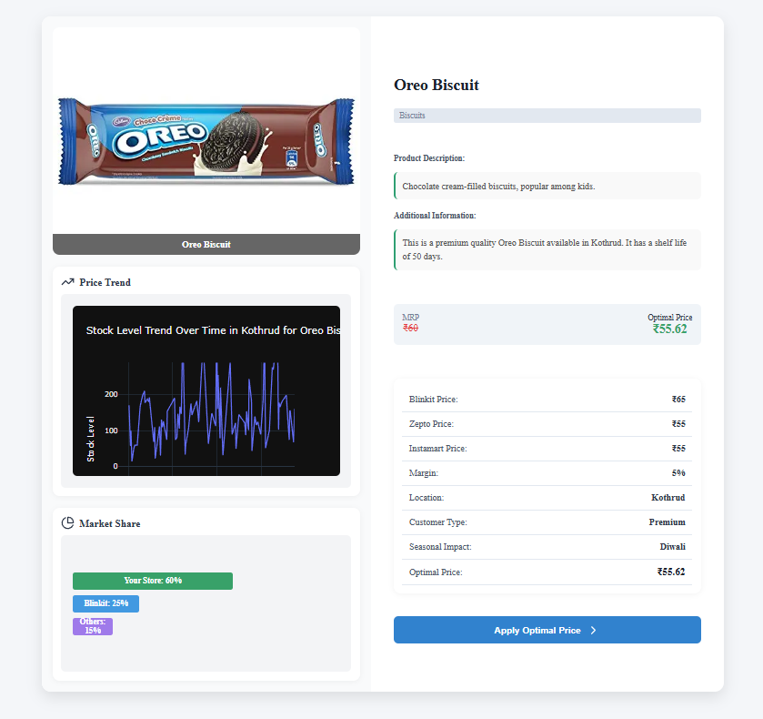

# Smart Dynamic Pricing System

## Overview
The *Smart Dynamic Pricing System* is an AI-driven pricing solution designed for e-commerce businesses. It predicts optimal product prices based on real-time data, competitor prices, customer demand, stock levels, and seasonal trends. This helps businesses maximize revenue while staying competitive.

## Features
- *AI-Based Price Prediction*: Uses machine learning to determine the best product prices.
- *Real-Time Data Processing*: Fetches competitor prices (Blinkit, Zepto, Instamart) and market trends.
- *Stock Level Analysis*: Displays stock trends and inventory fluctuations.
- *User-Friendly Dashboard*: Provides an intuitive interface for decision-making.
- *Seamless API Integration*: FastAPI-based backend for efficient data handling.
- *Database Management*: Uses Supabase for product and pricing data storage.
- *Graphical Insights*: Stock trends and pricing predictions visualized using Graph API.

## Tech Stack
- *Frontend*: React.js
- *Backend*: FastAPI
- *Database*: Supabase
- *Machine Learning*: Python ( Pandas, NumPy)
- *Visualization*: Graph API (Matplotlib, Plotly)

## Dataset
- The dataset consists of *10,000 entries* with *18 unique products*.
- Features include *MRP, competitor prices, discount percentage, margin, customer sentiment, seasonal impact, stock levels, and delivery distance*.

- ## Sample Output Image

Below is a sample preview of the dataset generated:




## How It Works

- **Fixed MRP per Product:**\
  Each product has a constant MRP throughout the dataset.

- **Dynamic Pricing:**\
  Prices for Blinkit, Zepto, and Instamart are computed by applying a discount to the MRP, ensuring all platform prices remain below the MRP.

- **Additional Realistic Attributes:**\
  The script includes fields for product margin, shelf life (derived from the product category), stock levels, and a random order timestamp to enhance the realism of the dataset.

- **Randomized Data:**\
  Details such as location, festive impact, delivery distance, and customer sentiment are randomized to simulate real-world variability.

## Prerequisites

Make sure you have the following installed:

- **Python 3.x**
- **pandas** library\
  Install via:
  ```bash
  pip install pandas
  ```

## Installation
1. Clone the repository:
   sh
   git clone https://github.com/your-repo/smart-dynamic-pricing.git
   cd smart-dynamic-pricing
   
2. Install dependencies:
   sh
   pip install -r requirements.txt  # For backend
   npm install  # For frontend
   
3. Run the backend:
   sh
   uvicorn main:app --reload
   
4. Run the frontend:
   sh
   npm start
   

## Usage
- Navigate to the frontend dashboard.
- Upload product details and view AI-recommended pricing.
- Analyze stock level trends and make informed pricing decisions.
- Apply optimal pricing with a single click.

